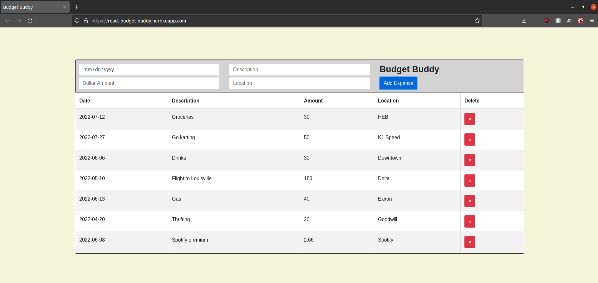

## Budget Buddy

`Budget Buddy` is an expense tracking application that aids any person to maintain a record of their spending habits so they don't have to!

[Live Demo](https://react-budget-buddy.herokuapp.com/)

### Summary

Have you ever forget even the littlest things? When it comes to grocery shopping, chores, or even important dates, it's hard to remember it all! I have a hard time keeping track of the activities and items I purchased throughout the month to account in my budget. An expense tracker keeps all my purchases in one place to allow me to become a more responsible spender. 

`Budget Buddy` is a React application that allows for a dynamic interface by taking advantage of React's tools. Some of the struggles I faced during this project was learning how parent and child components communicate, React's hooks to maintain states, and understand React's component lifecycles.

List of React concepts applied to this project:
1. Event listeners
2. State
3. Conditional rendering
4. Forms
5. Side effects

### Author

* **Anderson Duong** - Full-Stack Developer